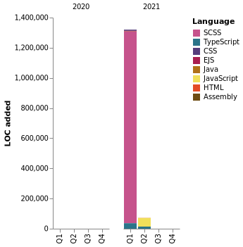

<h2>Felipe Brenner</h2>

<a href="https://app.rocketseat.com.br/me/felipe-de-oliveira-brenner-conta-ignite" target="_blank" rel="nofollow"></a>
<a href="https://www.instagram.com/felipeobrenner/" target="_blank" rel="nofollow"></a>
<a href="https://www.linkedin.com/in/felipe-de-oliveira-brenner/" target="_blank" rel="nofollow"></a>

---

- 🎓 Formado em **Técnico em Eletrônica** na **Fundação Escola Técnica Liberato Salzano Vieira da Cunha**
- 💻 Cursando **Ciências da Computação** na **Unisinos**
- 💻 Trabalhando na **Cigam Software Corporativo S.A.** com desenvolvimento em **T-SQL (SQL Server)** , **PL/SQL (Oracle)** e **Magic (uniPaaS e xpa)**
- 💻 Experiência com projetos e estudos em **C++** e **Java** e estudando novas tecnologias como React.js e Node.js

---

<details open>
  <summary>📈 <b>Github Stats</b></summary>
  <br>
  <p align="center">
  
  
  </p>

</details>

<details>
  <summary>🤖 <b>Programming Stats</b></summary>
  <br/>

  <!--START_SECTION:waka-->

> 🏆 543 Contributions in the Year 2021
>
> 📦 232.9 kB Used in Github's Storage
>
> 📜 39 Public Repositories
>
> 🔑 4 Private Repositories

**I'm an Early 🐤**

```text
🌞 Morning    21 commits     ████░░░░░░░░░░░░░░░░░░░░░   16.67%
🌆 Daytime    49 commits     █████████░░░░░░░░░░░░░░░░   38.89%
🌃 Evening    54 commits     ██████████░░░░░░░░░░░░░░░   42.86%
🌙 Night      2 commits      ░░░░░░░░░░░░░░░░░░░░░░░░░   1.59%

```

📅 **I'm Most Productive on Wednesday**

```text
Monday       18 commits     ███░░░░░░░░░░░░░░░░░░░░░░   14.29%
Tuesday      11 commits     ██░░░░░░░░░░░░░░░░░░░░░░░   8.73%
Wednesday    22 commits     ████░░░░░░░░░░░░░░░░░░░░░   17.46%
Thursday     16 commits     ███░░░░░░░░░░░░░░░░░░░░░░   12.7%
Friday       22 commits     ████░░░░░░░░░░░░░░░░░░░░░   17.46%
Saturday     18 commits     ███░░░░░░░░░░░░░░░░░░░░░░   14.29%
Sunday       19 commits     ███░░░░░░░░░░░░░░░░░░░░░░   15.08%

```

**I Mostly Code in TypeScript**

```text
TypeScript               17 repos            █████████░░░░░░░░░░░░░░░░   36.96%
JavaScript               13 repos            ███████░░░░░░░░░░░░░░░░░░   28.26%
Java                     7 repos             ███░░░░░░░░░░░░░░░░░░░░░░   15.22%
TeX                      4 repos             ██░░░░░░░░░░░░░░░░░░░░░░░   8.7%
HTML                     3 repos             █░░░░░░░░░░░░░░░░░░░░░░░░   6.52%

```

**Timeline**



<!--END_SECTION:waka-->
</details>
